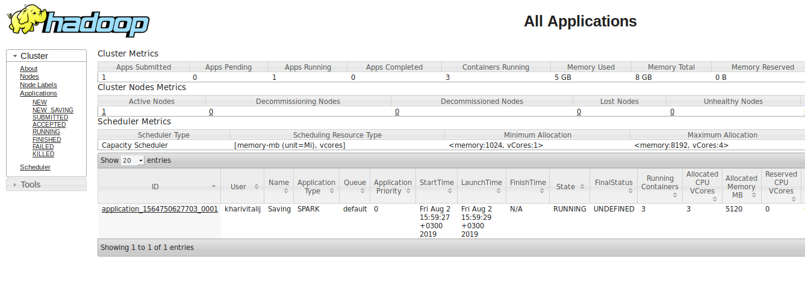
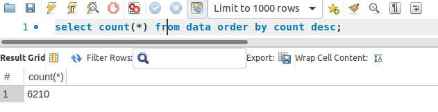

# etlink (ETL service)

Python version of ETLink application.

## How to test?
 
1. Go to the directory with python modules.
```
$ cd etlink/python-modules
```
2. Run tests.
```
$ python3 -m unittest discover -s . -p "*_test.py"
```
 
## How to run?

1. Go to the etlink directory.
```
$ cd etlink
```
2. Build docker image for application.
```
$ docker build -t workflow .
```
3. Run luigi, mysql services using docker-compose.
```
$ docker-compose up
```
4. Run application image in container.
```
$ docker run -v $HOME:$HOME --network host workflow url1 url2 url3
```

## Simple workflow example

#### Make sure, database isn't populated yet:

Connect to mysql instance running on localhost:3306 with credentials:
```
MYSQL_DATABASE: test
MYSQL_USER: workflow
MYSQL_PASSWORD: exercise
```
And run
```
select count(*) from data order by count desc;
```


#### We will run next command:

```
$ docker run -v $HOME:$HOME --network host workflow https://en.wikipedia.org/wiki/Napoleon https://ru.wikipedia.org/wiki/Audi https://ru.wikipedia.org/wiki/BMW https://ru.wikipedia.org/wiki/Volkswagen https://ru.wikipedia.org/wiki/Dodge https://ru.wikipedia.org/wiki/Fiat https://ru.wikipedia.org/wiki/Ford
```
to retrieve data from listed sources.

#### Navigate to [Luigi scheduler Web UI](localhost:8082) to see tasks states and dependency graph:


#### Navigate to [http://localhost:8088](localhost:8088) to see hadoop applications on yarn scheduler:




#### Navigate to [http://localhost:9870](localhost:9870) to see HDFS related information:


Extraction tasks output:

Saving task output:


#### And finally check mysql database for results:

```
select * from data order by count desc;
```


```
select count(*) from data order by count desc;
```


#### You will see the following lines in the logs:
```
===== Luigi Execution Summary =====

Scheduled 9 tasks of which:
* 9 ran successfully:
    - 1 DBUpload(...)
    - 7 Extraction(url=https://en.wikipedia.org/wiki/Napoleon) ...
    - 1 Saving(...)

This progress looks :) because there were no failed tasks or missing dependencies

===== Luigi Execution Summary =====
```

Please, feel free to ask your questions - nikita.kharitonov99@gmail.com

